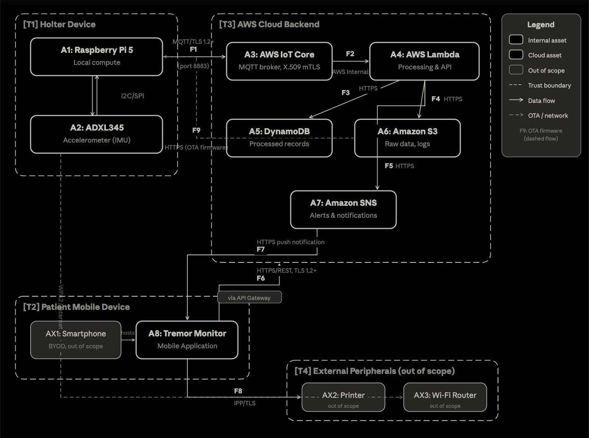
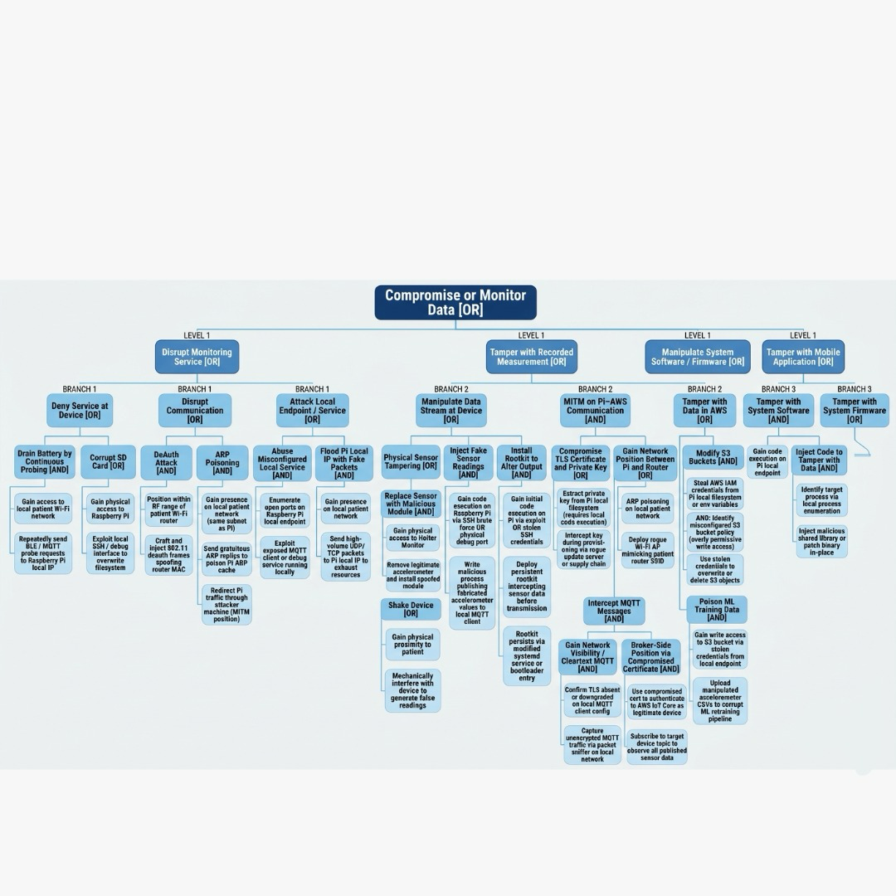
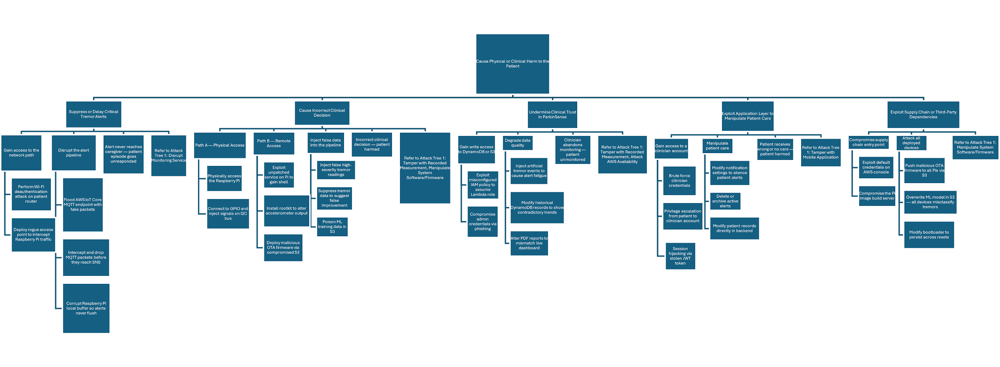
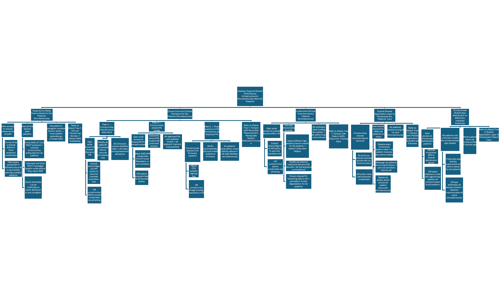

# Threat model and cybersecurity risk management

ParkinSense — Parkinson's tremor monitoring system. Prepared for JHU
EN.601.644 Medical Device Cybersecurity, following FDA premarket
cybersecurity guidance and ISO 14971 risk management principles.

Account identifiers, endpoints, and test credentials are redacted.
This is coursework: the device was never used with patients and is not
a cleared medical device.

## System data flow and trust boundaries

## Assets

| ID | Asset | Type | Ownership | Role |
|---|---|---|---|---|
| A1 | Raspberry Pi 5 | Device | Internal | Single-board computer serving as the core compute platform for the Holter Monitor, executing the operating system, FFT-based tremor detection firmware, local data buffering, and outbound data transmission |
| A2 | ADXL345 Accelerometer | Device | Internal | 3-axis digital accelerometer sensor that captures raw motion data from the patient's body for tremor detection |
| A3 | AWS IoT Core | Server | Third-Party | Managed MQTT message broker that authenticates the Holter Monitor device and ingests incoming sensor data for downstream processing |
| A4 | AWS Lambda Functions | System Software | Third-Party | Serverless compute functions that enrich raw accelerometer data, apply tremor severity classification, and trigger alert workflows |
| A5 | Amazon DynamoDB | Server | Third-Party | NoSQL database storing all processed patient tremor records, user account data, device registration metadata, and system configuration |
| A6 | Amazon S3 | Server | Third-Party | Object storage service archiving raw accelerometer data and system logs for regulatory compliance, audit trails, and retrospective analysis |
| A7 | Amazon SNS | Server | Third-Party | Managed notification service delivering real-time tremor severity alerts to clinicians and caregivers via push notifications and email |
| A8 | Tremor Monitor Mobile Application | Application Software | Internal | Mobile application enabling patients to view tremor history and enabling clinicians to monitor patients, review trends, and manage alerts |
| AX1 | Patient Smartphone | Device | Third-Party | Patient or clinician personal mobile device (BYOD) used to run the Tremor Monitor Mobile Application |
| AX2 | Network Printer | Peripheral | Third-Party | External printing resource for printing patient tremor reports from the Tremor Monitor Mobile Application |
| AX3 | Wi-Fi Router | Network Infrastructure | Third-Party | Patient-provided wireless router enabling the Holter Monitor to transmit data to the cloud backend via the internet |

### Asset descriptions

**A1 — Raspberry Pi 5**

The Raspberry Pi 5 is the central processing unit embedded within the Parkinson's Holter Monitor. It runs a hardened Linux OS, collects raw accelerometer data at ≥20 Hz, applies local timestamping via NTP, buffers data during connectivity loss, and transmits structured payloads to AWS IoT Core via MQTT over TLS 1.2+. Firmware updates are delivered via signed OTA packages from AWS S3.

**A2 — ADXL345 Accelerometer**

The accelerometer is an IMU sensor embedded in the Parkinson's Holter Monitor. It captures raw triaxial acceleration signals at a sampling rate of ≥20 Hz with a resolution of ≥2.87 cm/s² per increment. The raw signal is read by the Raspberry Pi over I2C/SPI and forwarded for FFT-based tremor classification. Sensor health checks and plausibility validation are performed at runtime to detect hardware faults.

**A3 — AWS IoT Core**

AWS IoT Core is a managed cloud service that serves as the primary ingestion point for tremor data transmitted from the Holter Monitor. The device authenticates to AWS IoT Core using X.509 device certificates over a TLS 1.2+ encrypted MQTT connection. IoT Core validates device identity, enforces IoT policies restricting publish/subscribe topics per device, and routes incoming messages to downstream services via IoT Rules. The service also supports device shadow for maintaining last-known device state.

**A4 — AWS Lambda Functions**

AWS Lambda Functions are manufacturer-developed serverless functions deployed on AWS. Upon receiving messages from the ingestion layer, the Lambda functions perform data enrichment including timestamp normalization, FFT spectral analysis validation, tremor severity scoring based on clinically defined thresholds, and patient context association. The functions also evaluate alert conditions and publish notifications when tremor severity exceeds configured thresholds. Lambda functions execute under IAM roles with least-privilege permissions scoped to specific authorized resources.

**A5 — Amazon DynamoDB**

Amazon DynamoDB is a managed NoSQL database service used to store structured patient data including processed tremor event records with severity scores, timestamps, and FFT analysis outputs. It also stores user account profiles, device registration and provisioning records, clinician-patient assignments, alert configuration thresholds, and system audit logs. Data at rest is encrypted using AES-256 via AWS KMS. Access to DynamoDB tables is restricted via IAM policies enforcing least-privilege access for authorized services only.

**A6 — Amazon S3**

Amazon S3 is a managed object storage service used to archive raw accelerometer sensor data as received from the Holter Monitor prior to any processing. This provides an authoritative record of original patient data for regulatory audit trails, retrospective clinical analysis, and data integrity verification. S3 buckets are configured with server-side encryption (AES-256 via AWS KMS) and versioning enabled. Record immutability is enforced using S3 Object Lock in Compliance Mode, which prevents any user including root from deleting or overwriting objects for a defined retention period. Bucket policies restrict access to authorized IAM roles only, and S3 access logging is enabled.

**A7 — Amazon SNS**

Amazon SNS (Simple Notification Service) is a managed pub/sub messaging service used to deliver real-time alerts when patient tremor severity exceeds clinically configured thresholds. Alert messages are published to SNS topics, which fan out notifications to subscribed endpoints including mobile push notifications (via the Tremor Monitor Mobile Application) and email addresses for clinicians and caregivers. SNS topics are encrypted in transit via TLS and access is restricted via IAM policies to authorized services only.

**A8 — Tremor Monitor Mobile Application**

The Tremor Monitor Mobile Application is a manufacturer-developed application installed on the patient's or clinician's personal smartphone (BYOD). It communicates with the cloud backend via HTTPS REST APIs. The application presents role-appropriate views: patients can view their own tremor history, severity trends, and alert notifications; clinicians can view assigned patients, review aggregated tremor data, and access historical reports. Role-based access control and authorization are enforced at the backend API layer, not within the client application. The application uses certificate pinning to prevent man-in-the-middle attacks and stores minimal cached data on the device using AES-256 encryption.

**AX1 — Patient Smartphone**

The Patient Smartphone is a personally owned iOS or Android mobile device belonging to the patient or clinician. It hosts the Tremor Monitor Mobile Application and provides the display, network connectivity, and local compute resources required to render patient data and receive alert notifications. The manufacturer has no control over the smartphone's operating system, installed applications, security patches, or network configuration.

**AX2 — Network Printer**

The Tremor Monitor Mobile Application may connect to a network printer via IPP to print patient symptom reports in PDF format. The printer is a patient-owned or facility-owned peripheral device. The manufacturer does not provide, configure, or maintain this printer.

**AX3 — Wi-Fi Router**

The Wi-Fi Router is a patient-owned consumer-grade wireless access point located in the patient's home or care facility. It provides 802.11 wireless connectivity for the Holter Monitor to reach the internet. The manufacturer does not provide, configure, or maintain this router; it is assumed to be existing infrastructure in the patient's environment. Router security (encryption standard, firmware updates, access controls) varies by patient and is outside manufacturer control.

## Data flows

| ID | Description | Sender | Receiver | Sensitive | Authn | Encrypted | Protocol |
|---|---|---|---|---|---|---|---|
| F1 | Communication between Raspberry Pi 5 and AWS IoT Core | Raspberry Pi 5 | AWS IoT Core | Y | Y | Y | MQTT |
| F2 | Communication between AWS IoT Core and AWS Lambda Functions | AWS IoT Core | AWS Lambda Functions | Y | Y | Y | AWS Internal |
| F3 | Communication between AWS Lambda Functions and Amazon DynamoDB | AWS Lambda Functions | Amazon DynamoDB | Y | Y | Y | HTTPS |
| F4 | Communication between AWS Lambda Functions and Amazon S3 | AWS Lambda Functions | Amazon S3 | Y | Y | Y | HTTPS |
| F5 | Communication between AWS Lambda Functions and Amazon SNS | AWS Lambda Functions | Amazon SNS | Y | Y | Y | HTTPS |
| F6 | Communication between Amazon DynamoDB and Tremor Monitor Mobile Application | Amazon DynamoDB | Tremor Monitor Mobile Application | Y | Y | Y | HTTPS |
| F7 | Communication between Amazon SNS and Tremor Monitor Mobile Application | Amazon SNS | Tremor Monitor Mobile Application | Y | Y | Y | HTTPS |
| F8 | Communication between Tremor Monitor Mobile Application and Network Printer | Tremor Monitor Mobile Application | Network Printer | Y | Y | Y | IPP |
| F9 | Communication between Amazon S3 and Raspberry Pi 5 | Amazon S3 | Raspberry Pi 5 | Y | Y | Y | HTTPS |

## Threat actors

| ID | Title | Insider | Role | Skill |
|---|---|---|---|---|
| X1 | Patient | Y | Patient or User | Low |
| X2 | Clinician | Y | Authorized Clinical User | Low |
| X3 | IT Administrator | Y | System Administrator | Medium |
| X4 | Manufacturer Developer | Y | Manufacturer Employee | High |
| X5 | Manufacturer Competitor | N | N/A | Low |
| X6 | Hacker | N | N/A | Medium |
| X7 | Coordinated Group of Hackers | N | N/A | Medium |
| X8 | Nation-State | N | N/A | High |

### Threat actor profiles

**X1 — Patient** (skill: Low)

Parkinson's disease patient wears the ParkinSense Holter Monitor for continuous tremor monitoring.

**X2 — Clinician** (skill: Low)

A Clinician monitors patients using the Tremor Monitor Mobile Application to review tremor data, adjust alert thresholds, and make treatment decisions.

**X3 — IT Administrator** (skill: Medium)

An authorized administrator who manages the AWS cloud infrastructure, device provisioning, and system configuration for ParkinSense.

**X4 — Manufacturer Developer** (skill: High)

An authorized developer of the ParkinSense system who implements, configures, and tests the device firmware, cloud infrastructure, and mobile application.

**X5 — Manufacturer Competitor** (skill: Low)

Employees of a competing Parkinson's monitoring device company with domain knowledge of movement disorder monitoring but limited knowledge of the ParkinSense system architecture.

**X6 — Hacker** (skill: Medium)

An individual with limited knowledge of the ParkinSense system architecture who attempts to gain unauthorized access for personal gain or notoriety.

**X7 — Coordinated Group of Hackers** (skill: Medium)

A group with variable knowledge of Parkinson's disease monitoring but limited knowledge of the ParkinSense system architecture who coordinate attacks for financial or ideological gain.

**X8 — Nation-State** (skill: High)

A state-sponsored threat actor targeting healthcare infrastructure, medical device supply chains, or patient data for espionage, disruption, or geopolitical leverage.

## Attack trees

Each tree decomposes an attacker goal down to leaf-level actions with
explicit AND/OR gates.

### Attack tree 1 — Compromise or monitor data

### Attack tree 2 — Cause physical or clinical harm to the patient

### Attack tree 3 — Multi-patient harm via shared infrastructure

## STRIDE hazard analysis and risk evaluation

7 hazards evaluated across the STRIDE categories. Each is scored pre- and
post-mitigation on both a patient-harm and a non-harm axis, using
severity x exploitability to produce a risk priority number.

| ID | STRIDE | Property violated | Asset | Harm risk (pre → post) | Non-harm risk (pre → post) |
|---|---|---|---|---|---|
| H1 | Spoofing | Authentication | A1 Raspberry Pi 5 | Low → Low | Moderate → Low |
| H2 | Spoofing | Authentication | A8 Mobile Application | → | → |
| H3 | Tampering | Integrity | A1 Raspberry Pi 5 | Moderate → Moderate | Moderate → Moderate |
| H4 | Repudiation | Non-repudiation | A1 Raspberry Pi 5 | None or N/A → None or N/A | Low → Low |
| H5 | Information Disclosure | Confidentiality | A1 Raspberry Pi 5 | None or N/A → None or N/A | Moderate → Low |
| H6 | Denial of Service | Availability | A1 Raspberry Pi 5 | Low → Low | Moderate → Moderate |
| H7 | Elevation of Privilege | Authorization | A1 Raspberry Pi 5 | Low → Low | Moderate → Low |

### Hazard detail

#### H1 — Spoofing (Authentication)

*Asset:* A1 Raspberry Pi 5 · *Threat actors:* Service or Program Spoofing X5, X6, X7, X8 Identity Spoofing X1, X2 Network Address or Data Spoofing X6, X7, X8 Bus Spoofing X3, X4, X6, X7, X8 Sensor Spoofing X1, X2, X6, X7, X8 MQTT Broker Spoofing: X6, X7, X8. I2C Sensor Input Spoofing: X4, X6, X7, X8. Physical Sensor Spoofing: X1, X2, X6, X7. Credential Brute Force: X6, X7, X8

**Threat scenarios**

MQTT Broker Spoofing
A threat actor sets up a rogue MQTT broker mimicking the AWS IoT Core endpoint. The Pi is deceived into transmitting patient tremor data to an attacker-controlled server via DNS poisoning or a rogue Wi-Fi access point. 

I2C Sensor Input Spoofing
A threat actor with physical access connects to the I2C bus and injects fabricated accelerometer readings, replacing legitimate ADXL345 output with spoofed values that bias the FFT tremor classification algorithm. 

Physical Sensor Spoofing
A threat actor with physical proximity to the patient mechanically vibrates or shakes the ADXL345 sensor in a controlled pattern. The induced motion is misclassified by the FFT algorithm as a tremor episode, creating false clinical events. 

Credential Brute Force
A threat actor brute forces SSH credentials to impersonate an authorized administrator, gaining control over the acquisition pipeline and MQTT client configuration.

**Attack path**

MQTT Broker Spoofing 
1. Threat actor sets up rogue MQTT broker mimicking AWS IoT Core endpoint. 
2. Threat actor uses DNS poisoning or rogue Wi-Fi AP to redirect Pi's MQTT traffic. 
3. Pi connects to rogue broker and publishes patient tremor data to attacker-controlled server. 

I2C Sensor Input Spoofing 
1. Threat actor gains physical access to the Holter Monitor. 
2. Threat actor connects bus pirate to I2C SDA/SCL pins. 
3. Threat actor injects fabricated accelerometer readings onto the bus. 
4. FFT algorithm processes spoofed data and generates false tremor classifications. 

Physical Sensor Spoofing 
1. Threat actor gains physical proximity to patient. 
2. Threat actor mechanically vibrates or shakes the ADXL345 sensor. 
3. FFT algorithm classifies induced motion as tremor episode. 

Credential Brute Force 
1. Threat actor scans network and discovers SSH on the Pi. 
2. Threat actor runs hydra with common credential lists. 
3. On success, threat actor logs in and gains control of the device.

**Mitigations**

MQTT Broker Spoofing 
1. DI24. 
2. None. 
3. DI21, DI24. 

I2C Sensor Input Spoofing 
1. None. 
2. None. 
3. None. 
4. None. 

Physical Sensor Spoofing 
1. None. 
2. None. 
3. None. 

Credential Brute Force 
1. DI25. 
2. DI29. 
3. DI30.

**Risk-level justification**

Identity Spoofing (steps 1-2): No cryptographic control can authenticate that the wearer of a wearable device is the intended patient. This is a design limitation inherent to all wearable medical devices. Risk is accepted as the clinical workflow requires a clinician to correlate device data with a patient visit, reducing the impact of identity spoofing.

I2C Sensor Input Spoofing (steps 1-4 — None): No cryptographic authentication standard exists for the I2C protocol at the hardware level. This is a fundamental design limitation of the I2C bus specification shared by all I2C-connected sensor systems. Physical access to the device interior is required. The device enclosure provides a physical deterrent. Residual risk is Low. 

Physical Sensor Spoofing (steps 1-3 — None): Physical proximity attacks on the wearable sensor cannot be mitigated by software or firmware controls. This risk is inherent to all wearable monitoring devices. Clinical review of tremor data by a trained clinician prior to medication adjustment provides a compensating procedural control. Residual risk is Low.

MQTT Broker Spoofing (step 2 — None): The patient's Wi-Fi router (AX3) is an out-of-scope asset. The manufacturer does not control the patient's home network infrastructure. TLS 1.2+ mutual authentication (DI21) and authorized endpoint enforcement (DI24) ensure that even if DNS is poisoned, the Pi will reject a connection to a broker that cannot present a valid AWS IoT Core server certificate. Residual risk is Low.

*Patient harm:* Negligible severity, exploitability Occasional → Remote, risk Low → Low. *Non-harm:* Minor severity, exploitability Occasional → Remote, risk Moderate → Low.

#### H2 — Spoofing (Authentication)

*Asset:* A8 Mobile Application · *Threat actors:* 

**Threat scenarios**

Service or Program Spoofing
A threat actor may impersonate the AWS backend API to deceive the mobile app into submitting patient data to a malicious server.

Identity Spoofing
A threat actor creates a fake version of the ParkinSense mobile app with the same name, icon, and UI, and distributes it via a third-party app store or phishing link. A patient installs the fake app and enters their credentials, which are captured by the attacker

Network Address Spoofing
A threat actor on the same patient Wi-Fi network performs a Layer 2 ARP spoofing or MAC address spoofing attack, positioning themselves between the mobile app and the Wi-Fi router. The app's outbound HTTPS traffic is redirected through the attacker's machine, enabling a potential MitM position.

TLS Certificate Spoofing
A threat actor may present a forged or fraudulent TLS certificate to the mobile app to perform a man-in-the-middle attack on AWS-bound traffic.

Push Notification Spoofing
A threat actor may send fake push notifications impersonating the ParkinSense app to trick users into revealing credentials or accepting false clinical alerts.

Device Spoofing
A threat actor sets up a rogue device that mimics the Raspberry Pi's MQTT client ID and X.509 certificate fingerprint, attempting to publish falsified tremor data to AWS IoT Core under a legitimate device identity, which would be reflected in the clinician's mobile dashboard.

**Attack path**

Service or Program Spoofing
1. A threat actor registers a domain closely resembling the ParkinSense API endpoint (e.g., api.parkinsense-health.com vs api.parkinsense.com).
2. The attacker sends a phishing SMS or email to a clinician directing them to a fake login page.
3. Captured credentials are used to authenticate to the real AWS backend as the clinician.

Fake App (Identity Spoofing)
1. A threat actor clones the ParkinSense mobile app UI and publishes it to a third-party Android APK store with the same app name and icon.
2. A patient or clinician installs the fake app.
3. The fake app captures login credentials and forwards them to the attacker while displaying plausible-looking fake tremor data.

Network Address Spoofing (Layer 2 ARP)
1. A threat actor joins the same Wi-Fi network as the clinician's smartphone.
2. The attacker performs an ARP spoofing attack, broadcasting gratuitous ARP replies that associate the attacker's MAC address with the router's IP.
3. The mobile app's HTTPS traffic is routed through the attacker's machine; certificate pinning prevents decryption but traffic metadata is exposed.

TLS Certificate Spoofing
1. A threat actor operates a rogue Wi-Fi AP and presents a self-signed certificate to the mobile app.
2. If certificate pinning is not enforced, the app accepts the fraudulent certificate.
3. The attacker decrypts and reads all API traffic including patient tremor records and session tokens.

Device Spoofing toward App
1. A threat actor extracts or guesses a device's MQTT client ID and crafts MQTT messages mimicking that device.
2. The attacker publishes fabricated tremor severity data to AWS IoT Core under the legitimate device identity.
3. The falsified data propagates through Lambda to DynamoDB and is displayed to the clinician in the mobile app as real patient readings.

**Mitigations**

Service or Program Spoofing
1. None — domain impersonation is not preventable at the application layer.
2. None — phishing attack vector is outside application control.
3. DI28 — session timeout limits token reuse; None — no formal design input exists for physical enclosure or secure boot 
in the current requirements. Physical enclosure is a hardware design deterrent.

Fake App
1. None — manufacturer cannot prevent third-party app stores from hosting clones.
2. None — end-user installation choices are outside manufacturer control.
3. DI20 — MFA enforcement means captured credentials alone are insufficient to authenticate.

Network Address Spoofing (ARP)
1. None — manufacturer does not control patient/clinician Wi-Fi network (AX3 out of scope).
2. None
3. DI21 — TLS 1.2+ with certificate pinning prevents decryption of traffic regardless of ARP position.

TLS Certificate Spoofing
1. None — rogue AP setup is outside manufacturer control.
2. DI21 — certificate pinning is enforced in the mobile app; self-signed or untrusted certificates are rejected.
3. DI21 — if pinning is enforced, this step cannot be completed.

Device Spoofing toward App
1. DI21 — mutual TLS (X.509 per-device certificate) required by AWS IoT Core; spoofing requires possession of the device's private key.
2. None — if private key is compromised, no further control prevents publishing.
3. DI19 — RBAC at API layer; DI27 — CloudTrail anomaly detection on unusual publish patterns.

**Risk-level justification**

Service or Program Spoofing (steps 1-2): Phishing and domain impersonation are social engineering attacks outside the scope of application-layer controls. Industry practice accepts this residual risk and compensates with MFA (DI20) and user security awareness. Post-mitigation risk is Low.

Fake App (steps 1-2): Third-party app store distribution is outside manufacturer control. Mitigated by publishing only on official Google Play and Apple App Store with verified developer certificates. MFA (DI20) ensures credential theft alone cannot complete authentication. Residual risk is Low.

Network Address Spoofing (steps 1-2): ARP spoofing on patient/clinician home or clinical networks cannot be controlled by the manufacturer. AX3 (Wi-Fi Router) is an out-of-scope asset. Certificate pinning (DI21) compensates by ensuring traffic integrity regardless of network-layer position.

Device Spoofing step 2: If a device's private key is exfiltrated via physical compromise, no software control can prevent its misuse. This is a design limitation of public-key cryptography on commodity hardware without a TPM. The risk is mitigated at the detection layer via CloudTrail anomaly alerting (DI27). Residual risk is accepted as Low given the physical access prerequisite.

*Patient harm:*  severity, exploitability  → , risk  → . *Non-harm:*  severity, exploitability  → , risk  → .

#### H3 — Tampering (Integrity)

*Asset:* A1 Raspberry Pi 5 · *Threat actors:* Network Data Tampering X6, X7, X8 Persistent Data Tampering X3, X4, X6, X7, X8 Bus Tampering X4, X6, X7, X8 Sensor Tampering X1, X2, X6, X7 Physical Tampering X1, X2, X5, X6, X7, X8 Network Data Tampering: X6, X7, X8. I2C Bus Tampering: X4, X6, X7, X8. SD Card Tampering: X4, X5, X6, X7, X8. GPIO Tampering: X4, X6, X7, X8.

**Threat scenarios**

Network Data Tampering (via TLS Downgrade) — A threat actor positions as MitM on the patient's Wi-Fi network and attempts to downgrade or strip TLS on the MQTT connection to modify tremor data in transit.

I2C Bus Tampering — A threat actor with physical access injects forged I2C read responses on the bus between the ADXL345 and the Raspberry Pi, replacing real accelerometer values with fabricated tremor patterns.

SD Card Tampering — A threat actor removes the SD card, mounts it externally, and modifies the acquisition script to bias sensor readings before transmission. The card is replaced and the modified script runs on next boot.

GPIO Tampering — A threat actor connects to the GPIO header pins and injects signals directly onto the I2C SDA/SCL lines via a logic analyzer or bus pirate, manipulating the raw sensor data stream at the hardware level.

**Attack path**

Network Data Tampering 
1. Threat actor positions as MitM on patient Wi-Fi via ARP spoofing or rogue AP. 
2. Threat actor sends ClientHello with weak cipher suites to attempt TLS downgrade on MQTT connection. 
3. If Pi's MQTT client accepts weak ciphers, TLS session is broken and MQTT packets are modifiable. 
4. Threat actor modifies tremor amplitude values or patient IDs in the payload before forwarding to AWS IoT Core. 

I2C Bus Tampering 
1. Threat actor gains physical access to the Holter Monitor. 
2. Threat actor connects bus pirate to I2C bus between ADXL345 and Pi. 
3. Threat actor injects forged I2C read responses with fabricated tremor patterns. 

SD Card Tampering 
1. Threat actor gains physical access and removes SD card. 
2. Threat actor mounts card on another Linux machine. 
3. Threat actor modifies acquisition.py to bias sensor readings before transmission. 
4. Threat actor replaces SD card; modified script runs on next boot. 

GPIO Tampering 
1. Threat actor gains physical access and connects to GPIO header pins. 
2. Threat actor injects signals onto I2C SDA/SCL lines via logic analyzer or bus pirate.

**Mitigations**

Network Data Tampering 
1. None. 2. DI21. 3. DI21. 4. DI24. I2C 

Bus Tampering 
1. None. 2. None. 3. None. 

SD Card Tampering 
1. None. 2. DI22. 3. DI22, DI26. 4. DI26. 

GPIO Tampering 
1. None. 2. None.

**Risk-level justification**

I2C Bus Tampering (steps 2-3 — None): 
No cryptographic authentication standard exists for the I2C protocol. This is a fundamental hardware design limitation shared by all I2C-connected sensor systems. Physical access to the device interior is required, and the enclosure provides a deterrent. Residual risk is Low. 

SD Card Tampering (steps 1-2 without LUKS):
LUKS full-disk encryption is the intended production control (DI22). For the course prototype on borrowed hardware, LUKS is constrained by the inability to burn OTP keys. This is a documented design limitation of the prototype. Residual risk for prototype is Medium, accepted. 

GPIO Tampering (step 2 — None): 
Same as I2C — hardware protocol limitation. No software mitigation can authenticate analog bus signals. Requires sustained physical access and specialized equipment. Residual risk is Low.

*Patient harm:* Serious severity, exploitability Occasional → Remote, risk Moderate → Moderate. *Non-harm:* Critical severity, exploitability Occasional → Remote, risk Moderate → Moderate.

#### H4 — Repudiation (Non-repudiation)

*Asset:* A1 Raspberry Pi 5 · *Threat actors:* Repudiation X3, X4, X6, X7, X8 Log Alteration: X3, X4, X6, X7, X8. System Clock Reset: X3, X4, X6, X7, X8.

**Threat scenarios**

Log Alteration
A threat actor gains physical access to the Pi, removes the SD card, and modifies or deletes audit log entries that recorded their previous unauthorized access attempts, firmware modifications, or configuration changes.

System Clock Reset 
A threat actor who has gained root access resets the system clock to a past timestamp, making it impossible to correlate log entries with the actual time of the attack. The NTP daemon is then disabled to prevent automatic clock correction.

**Attack path**

Log Alteration

Threat actor gains physical access to the Raspberry Pi and removes the SD card.

Threat actor mounts the card externally and navigates to the application log directory.

Threat actor edits or deletes log entries recording unauthorized access attempts or firmware modifications.

Threat actor replaces the SD card; no evidence of intrusion remains on the device.

System Clock Reset

Threat actor gains root access on the Pi via credential compromise or privilege escalation.

Threat actor resets the system clock to a past timestamp using date -s.

Subsequent log entries are recorded with incorrect timestamps.

Threat actor disables the NTP daemon to prevent automatic time correction.

**Mitigations**

Log Alteration 
1. DI22. 2. DI22. 3. DI27. 4. DI27. 

System Clock Reset 
1. None. 2. DI27. 3. DI27. 4. None.

**Risk-level justification**

System Clock Reset (step 1 — None): Resetting the system clock requires prior root-level access. This attack is contingent on a successful privilege escalation (H7). The controls in H7 (DI25 Tailscale SSH, DI29 lockout, DI30 password policy) reduce the likelihood of root access to Improbable. If root is achieved, clock manipulation is a secondary concern addressed by server-side CloudTrail timestamps (DI27) which cannot be altered from the device. Residual risk is Low. 

System Clock Reset (step 4 — None): 
NTP daemon disablement requires root access — same prerequisite as step 1. The systemd service restarts NTP on reboot, and clock drift monitoring in the cloud detects anomalous skew. Residual risk is Low.

*Patient harm:* None or N/A severity, exploitability None or N/A → None or N/A, risk None or N/A → None or N/A. *Non-harm:* Minor severity, exploitability Remote → Remote, risk Low → Low.

#### H5 — Information Disclosure (Confidentiality)

*Asset:* A1 Raspberry Pi 5 · *Threat actors:* Network Sniffing or Eavesdropping X6, X7, X8 Unauthorized Data Access X3, X4, X6, X7, X8 Unauthorized Storage Access X4, X5, X6, X7, X8 Network Sniffing: X6, X7, X8. Debug Interface Access: X3, X4, X6, X7, X8. Unauthorized Storage Access: X4, X5, X6, X7, X8.

**Threat scenarios**

Network Sniffing —
A threat actor compromises the patient's Wi-Fi router or deploys a rogue AP on the same network segment and uses Wireshark or tcpdump to capture all MQTT traffic from the Pi.

Debug Interface Access —
A threat actor connects a USB-to-UART adapter to the Pi's UART0 serial pins (GPIO 14/15). If the serial console is enabled, the attacker interrupts the boot process and gains a root shell without authentication. From the root shell, the attacker reads in-memory MQTT private keys, dumps the I2C bus, or copies the SD card contents.

Unauthorized Storage Access - 
A threat actor removes the SD card from the Pi. Because LUKS full-disk encryption is absent in the prototype, the attacker mounts the partition on any Linux machine and reads the X.509 private key, Wi-Fi credentials, application logs, and locally buffered tremor data in plaintext.

**Attack path**

Network Sniffing 
1. Threat actor compromises patient's Wi-Fi router or deploys rogue AP on the same network segment. 2. Threat actor uses Wireshark or tcpdump to capture all traffic on the network segment. 3. Since MQTT traffic is encrypted with TLS 1.2+, packet contents are ciphertext; however, traffic metadata (timing, size patterns, connection frequency) may reveal device activity patterns. 

Debug Interface Access 
1. Threat actor gains physical access to the Raspberry Pi. 2. Threat actor connects USB-to-UART adapter to UART0 serial pins (GPIO 14/15 TXD/RXD). 3. If serial console is enabled (console=serial0 in cmdline.txt), attacker interrupts boot process and gains unauthenticated root shell. 4. From root shell, attacker reads in-memory MQTT private keys, dumps I2C bus using i2cdump, or copies entire SD card. 

Unauthorized Storage Access 
1. Threat actor removes SD card from the Raspberry Pi. 2. Attacker mounts partition on another Linux machine (sudo mount /dev/sdb2 /mnt). 3. Attacker reads /path/to/hardware/certs/ — X.509 private key and certificate in plaintext. 4. Attacker reads wpa_supplicant.conf — patient's Wi-Fi credentials. 5. Attacker reads application logs and locally buffered tremor data.

**Mitigations**

Network Sniffing 
1. None. 2. DI21. 3. None. 

Debug Interface Access 
1. None. 2. None. 3. DI23. 4. DI22. 

Unauthorized Storage Access 
1. None. 2. DI22. 3. DI22. 4. DI22. 5. DI22.

**Risk-level justification**

Network Sniffing — metadata (step 3 — None): 
Traffic timing and size metadata cannot be obscured without traffic shaping or padding, which is not implemented. The clinical impact of metadata disclosure (activity patterns only) is Minor; no PHI is exposed via metadata alone. Residual risk is Low. 

Debug Interface Access (step 2 — None): The UART pins are physically present on the Raspberry Pi PCB and cannot be removed by the manufacturer. This is a hardware design limitation. Mitigation is through serial console disablement (DI23: console=serial0 removed from cmdline.txt, getty@serial0 disabled). In production, the serial console would be permanently disabled and the enclosure sealed. For the prototype, this is a documented gap. 

Unauthorized Storage Access (step 1 — None): 
Physical SD card removal cannot be prevented by software. DI22 (LUKS full-disk encryption) is the intended production control. For the course prototype on borrowed hardware, LUKS is not deployed due to OTP key constraints. This is a documented design limitation. Residual risk for prototype is Medium, accepted as known gap pending production hardening.\

*Patient harm:* None or N/A severity, exploitability None or N/A → None or N/A, risk None or N/A → None or N/A. *Non-harm:* Minor severity, exploitability Occasional → Remote, risk Moderate → Low.

#### H6 — Denial of Service (Availability)

*Asset:* A1 Raspberry Pi 5 · *Threat actors:* Network DoS or DDoS X6, X7, X8 Jamming or Interference X6, X7, X8 Overloading Memory X6, X7, X8 Exhausting Device Power X1, X6, X7 Network DoS: X6, X7, X8. Wi-Fi Jamming: X6, X7, X8. I2C Bus Flooding: X6, X7, X8. Exhausting Resources: X1, X6, X7. Exhausting Power: X1, X6, X7.

**Threat scenarios**

Network DoS / MQTT Flood — 
A threat actor identifies the Pi's AWS IoT Core MQTT connection by monitoring network traffic and floods the broker endpoint (port 8883) with malformed TLS ClientHello packets, disrupting the device's cloud connectivity.

Wi-Fi Jamming — 
A threat actor within RF range deploys a 2.4GHz or 5GHz jamming device. The Pi's Wi-Fi radio loses association with the access point and all MQTT transmission halts. 

I2C Sensor Bus Flooding — 
A threat actor with physical access connects a signal generator to the I2C SDA line and injects rapid spurious transactions. The ADXL345 FIFO fills with noise data and the acquisition loop is overwhelmed. 

Exhausting Device Resources — 
A threat actor discovers an inadvertently exposed service on the Pi (e.g., debug HTTP server) and sends repeated requests that trigger computationally expensive FFT processing, exhausting CPU and memory until the acquisition loop halts.

Exhausting Device Power — 
A threat actor sends a continuous flood of MQTT messages to the Pi's subscribed topics, keeping the Wi-Fi radio and CPU in constant high-power state. The battery drains at 3-4x normal rate and the device shuts down mid-monitoring session.

**Attack path**

Network DoS / MQTT Flood

Threat actor identifies the Pi’s MQTT connection by monitoring network traffic on patient Wi-Fi.

Threat actor floods the MQTT broker endpoint (port 8883) with malformed TLS ClientHello packets.

Pi’s MQTT client connection is disrupted; device loses cloud connectivity.

Wi-Fi Jamming

Threat actor within RF range deploys a 2.4GHz or 5GHz jamming device.

Pi’s Wi-Fi radio loses association with the access point.

All MQTT transmission halts; locally buffered data accumulates until buffer limits are reached.

I2C Sensor Bus Flooding

Threat actor gains physical access to the Holter Monitor.

Threat actor connects a signal generator to the I2C SDA line.

ADXL345 FIFO fills with noise; acquisition loop is overwhelmed processing invalid readings.

Exhausting Device Resources

Threat actor discovers an exposed service on the Pi (e.g., debug HTTP server or MQTT debug endpoint).

Threat actor sends repeated requests triggering computationally expensive FFT operations.

CPU and memory are exhausted; main acquisition loop is starved and halts.

Exhausting Device Power

Threat actor sends a continuous flood of MQTT messages to the Pi’s subscribed topics.

Wi-Fi radio and CPU remain in a constant high-power state.

Battery drains at 3–4x the normal rate; device shuts down during monitoring.

**Mitigations**

Network DoS 
1. None. 2. DI23. 3. DI14. 

Wi-Fi Jamming 
1. None. 2. None. 3. DI14. 

I2C Bus Flooding 
1. None. 2. None. 3. None. 

Exhausting Resources 
1. DI23. 2. DI23. 3. DI23. 

Exhausting Power 
1. DI24. 2. None. 3. DI6.

**Risk-level justification**

Wi-Fi Jamming (steps 1-2 — None): 
RF jamming is a physical-layer attack that cannot be mitigated by any software or firmware control. This is a fundamental limitation of wireless communication. Compensated by local data buffering (DI14) which preserves data continuity during short jamming events. For sustained jamming, this is accepted as an environmental threat outside manufacturer control. Residual risk is Low. 

I2C Bus Flooding (steps 2-3 — None): Physical bus flooding requires sustained physical access with specialized equipment. No I2C authentication protocol exists. This is a hardware design limitation. Physical enclosure significantly limits exploitability. Residual risk is Low. 

Exhausting Power (step 2 — None): 
If AWS IoT Core is compromised by an attacker capable of sending arbitrary messages to device-subscribed topics, power exhaustion is an accepted secondary consequence. The prerequisite (IoT Core compromise) is a high-severity event addressed separately in the cloud backend threat model. No device-level control can prevent processing legitimate-appearing MQTT messages. Residual risk is accepted.

*Patient harm:* Negligible severity, exploitability Occasional → Occasional, risk Low → Low. *Non-harm:* Minor severity, exploitability Occasional → Occasional, risk Moderate → Moderate.

#### H7 — Elevation of Privilege (Authorization)

*Asset:* A1 Raspberry Pi 5 · *Threat actors:* Access Control Bypass X3, X4, X6, X7, X8 Privilege Escalation X3, X4, X6, X7, X8 OS Privilege Escalation: X3, X4, X6, X7, X8. SSH Default Credentials: X6, X7, X8. Overprivileged Service: X3, X4, X6, X7, X8. Absence of Security Modules: X6, X7, X8. MQTT Permission Abuse: X6, X7, X8.

**Threat scenarios**

OS Privilege Escalation via Kernel CVE — 
A threat actor exploits a known CVE in the Linux kernel version running on Raspberry Pi OS (e.g., dirty pipe, nftables privilege escalation) to escalate from an unprivileged user to root, gaining full control over the device firmware, sensor data pipeline, and X.509 certificates. 

SSH Default Credential Exploitation — 
A threat actor discovers SSH on the Pi (if not Tailscale-restricted) and attempts default Raspberry Pi credentials (pi/raspberry) or common weak passwords. On success, the attacker escalates to root via sudo. 

Overprivileged Service Exploitation — 
A threat actor exploits a buffer overflow or command injection in the acquisition service running as root. The payload executes with root privileges without requiring escalation since the service already runs as root. 

Absence of Kernel Security Modules — 
A threat actor achieves initial code execution in the acquisition process (e.g., via a library vulnerability in numpy or paho-mqtt). Without Seccomp or AppArmor restricting system calls, the attacker freely calls ptrace(), mount(), or chroot() to escape the application context and achieve full OS control. 

MQTT Client Permission Abuse — 
A threat actor compromises the Pi and obtains the device's X.509 certificate and private key. Using the stolen certificate, the attacker publishes MQTT messages to other patients' topics, injecting false tremor data into other patients' records.

**Attack path**

OS Privilege Escalation via Kernel CVE

Threat actor identifies a known CVE in the Linux kernel version running on Pi OS.

Threat actor gains initial code execution via a misconfigured exposed service.

Threat actor runs a publicly available kernel exploit to escalate from service account to root.

As root, attacker reads /etc/certs/ for X.509 private key, modifies acquisition script, or installs a persistent rootkit.

SSH Default Credential Exploitation

Threat actor scans the patient network and discovers the Pi's SSH port.

Threat actor attempts default credentials (pi/raspberry) or other common weak passwords.

On success, attacker logs in as a standard user and escalates to root via sudo.

Full root access grants control over all device functions.

Overprivileged Service Exploitation

Threat actor exploits a buffer overflow or command injection in acquisition.py running as root.

Injected payload executes with root privileges without any escalation step.

Attacker uses root shell to modify tremor data, extract certificates, or install a backdoor.

Absence of Kernel Security Modules

Threat actor achieves code execution in the acquisition process via a library vulnerability.

Without Seccomp or AppArmor, attacker freely calls ptrace() to attach to processes, mount() to remount filesystem, or chroot() to escape application directory.

Full OS control is achieved without an explicit privilege escalation exploit.

MQTT Client Permission Abuse

Threat actor compromises the Pi and obtains device X.509 certificate and private key from /path/to/hardware/certs/.

Using the stolen certificate, attacker publishes MQTT messages to other patients' topics.

False tremor data is injected into other patients' records.

**Mitigations**

OS Privilege Escalation 
1. None. 2. DI23. 3. None. 4. DI22. 

SSH Default Credentials 
1. DI25. 2. DI30. 3. DI29. 4. DI20. 

Overprivileged Service 
1. None. 2. None. 3. DI22. 

Absence of Security Modules 
1. None. 2. None. 3. None. 

MQTT Permission Abuse 
1. DI21, DI22. 2. DI19. 3. DI19.

**Risk-level justification**

OS Privilege Escalation (Steps 1, 3 — None)

No formal design input exists for OS patch management in the current requirements.

Kernel updates are treated as an operational procedure.

Zero-day CVEs cannot be prevented through design controls.

DI23 (port allowlist) minimizes attack surface for initial code execution; residual risk is Low given multiple prerequisites.

Overprivileged Service (Steps 1–2 — None)

Acquisition service runs as root instead of a dedicated low-privilege user, representing a configuration gap not covered by current design inputs.

In production, DI19 (RBAC) would require all device processes to run as least-privilege system accounts.

systemd unit file includes NoNewPrivileges=true, ProtectSystem=strict, and MemoryDenyWriteExecute=true as compensating controls.

For the prototype, risk is indirectly mitigated by DI22 (disk encryption) and DI23 (no exposed services); residual risk is Low.

Absence of Seccomp/AppArmor (Steps 1–3 — None)

Kernel security module profiles for the acquisition service are not defined in current cybersecurity requirements.

In production, AppArmor profiles would restrict the process to required system calls for I2C reading, MQTT publishing, and log writes.

This gap is accepted for the prototype given the multiple prerequisite steps required.

Residual risk is Low.

OS Privilege Escalation (Step 3 — None)

No design input can guarantee prevention of zero-day kernel exploits.

Kernel patching is handled as an operational control via unattended-upgrades.

Residual risk is accepted as Low since initial code execution (step 2) is mitigated by DI23.

*Patient harm:* Minor severity, exploitability Remote → Improbable, risk Low → Low. *Non-harm:* Serious severity, exploitability Remote → Improbable, risk Moderate → Low.

## Cybersecurity requirements

17 requirements, each traced to an asset and a control category.
Full traceability to user needs and verification activities is in
[design-controls.md](design-controls.md).

| ID | Asset | Requirement | Control category |
|---|---|---|---|
| DI6 | Raspberry Pi 5 | The battery of the wearable component shall last more than 24 hours under normal operating conditions without recharging. | Resiliency and recovery |
| DI14 | Raspberry Pi 5 | The Raspberry Pi shall maintain continuous symptom monitoring and alerting functions during transient wireless disconnection of up to 30 seconds. | Resiliency and recovery |
| DI15 | Raspberry Pi 5 | The system shall provide a status indicator showing connectivity state, battery level, and active alarms visible from the main clinician view. | Event detection and logging |
| DI18 | Raspberry Pi 5 | The Raspberry Pi shall maintain an audit log of all access to patient records, including user ID, timestamp, and action performed, retained for a minimum of 3 years. | Event detection and logging |
| DI19 | Raspberry Pi 5 | The system shall enforce role-based access control (RBAC) such that clinicians, IT administrators, and service accounts are granted only the minimum permissions required for their function. | Authorization |
| DI20 | Raspberry Pi 5 | The system shall enforce multi-factor authentication (MFA) for all IT administrator accounts at both the login endpoint of the application’s administrative web dashboard and for SSH remote maintenance access to the embedded devices prior to granting access to any system configuration or maintenance functions. | Authentication |
| DI21 | Raspberry Pi 5 | All patient data transmitted between the Raspberry Pi, mobile app, and AWS backend systems shall be encrypted using TLS 1.2 or higher with cipher suites that provide authenticated encryption and forward secrecy (e.g., AES-GCM or ChaCha20-Poly1305 with ECDHE). | Cryptography |
| DI22 | Raspberry Pi 5 | All patient data stored on the Raspberry Pi shall be encrypted at rest using AES-256 or an equivalent algorithm in a secure mode of operation (e.g., AES-GCM or AES-XTS). Insecure modes of operation such as ECB shall not be used. | Cryptography |
| DI23 | Raspberry Pi 5 | The Paspberry Pi shall restrict all network communications except for outbound MQTT over TLS on port 8883 for outbound data transmission and SSH on port 22 for remote maintenance. The cloud system shall restrict all network communications except for MQTT over TLS on port 8883 to receive telemetry data and HTTPS on port 443 for data transfer with authorized mobile applications. | Authorization |
| DI24 | Raspberry Pi 5 | The Raspberry Pi shall transmit MQTT telemetry data only to the authorized AWS IoT Core endpoints. | Authorization |
| DI25 | Raspberry Pi 5 | The Paspberry Pi shall allow SSH remote maintenance connections only through an authenticated TailScale VPN tunnel. | Authentication |
| DI26 | Raspberry Pi 5 | The Raspberry Pi shall provide a mechanism to roll back a failed software or firmware update to the last known good version. | Firmware and software update |
| DI27 | Raspberry Pi 5 | The system shall log all authentication events, access control decisions, and security-relevant configuration changes to a tamper-evident audit log. | Event detection and logging |
| DI28 | Raspberry Pi 5 | The mobile and desktop app shall implement session timeout, locking out inactive authenticated sessions after no more than 15 minutes with no user input. | Confidentiality |
| DI29 | Raspberry Pi 5 | The system shall reject all login attempts for 15 minuts after 3 failed login attempts to prevent brute forcing the credentials | Authentication |
| DI30 | Raspberry Pi 5 | The system shall require all passwords to be a combination of letters, numbers, and symbols that is 10-15 characters long. | Authentication |
| DI31 | Raspberry Pi 5 | The Raspberry Pi shall only accept siftware updates signed by valid private keys. | Code, data, and execution integrity |
